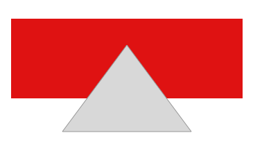
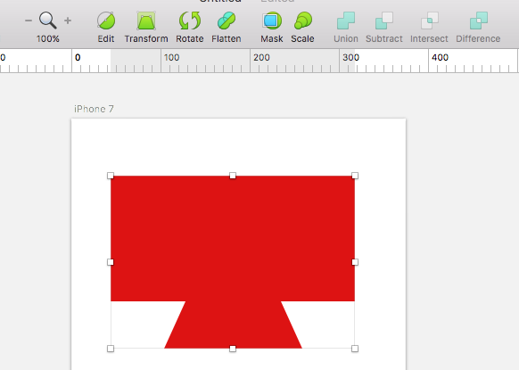
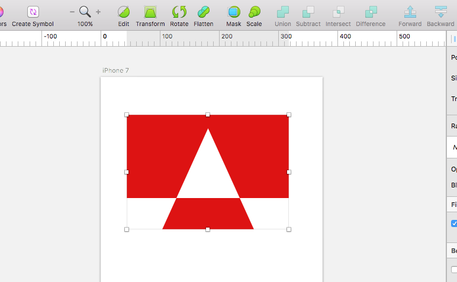
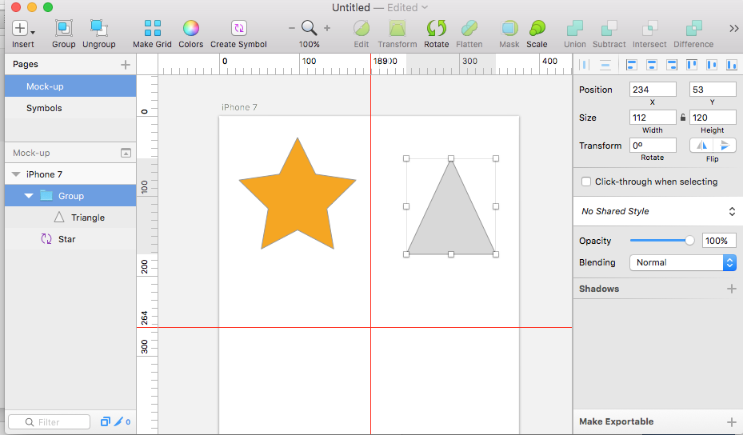
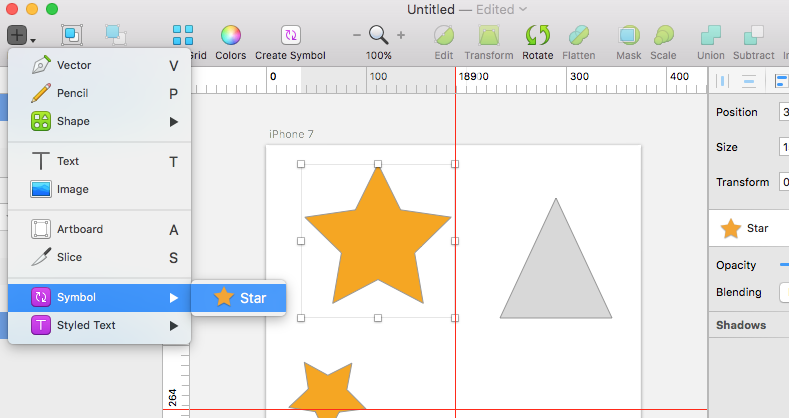
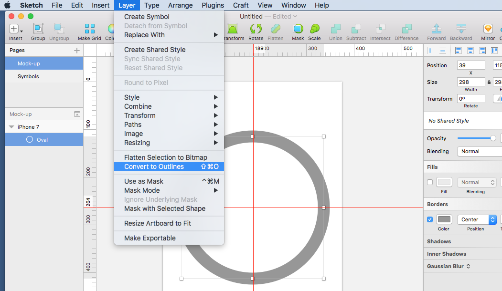
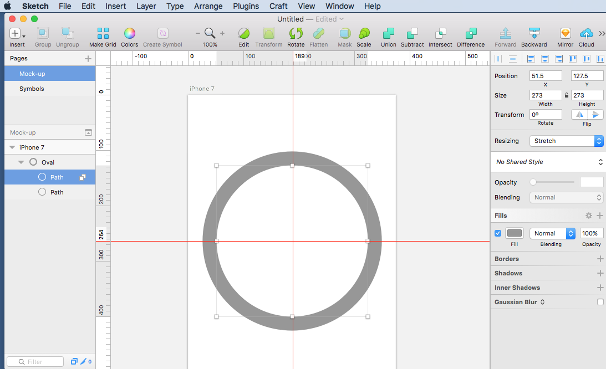
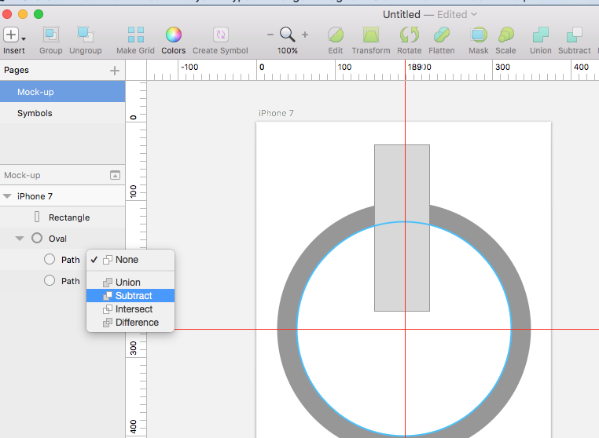
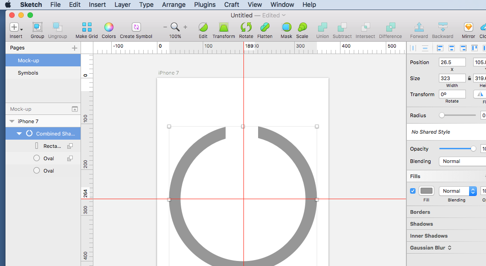

# Up & Running with Sketch

## Name a Page

## Add an Artboard

Select Artboard size from the right panel

## Add An Image

## Scale An Image

## Image Crop

## Issues when importing images

## Image Masks

## Image Fills (Colour Overlay)

## Add Text

## Add Grid or Column Guides

## Working With Shapes

Create 2 Shapes: Rectangle & Triangle on top

## Working with Symbols

## Deleting Parts of Shapes

