# Up & Running with Sketch

## Name a Page

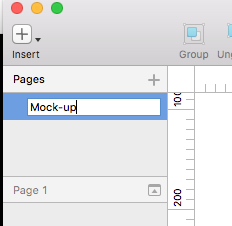

## Add an Artboard
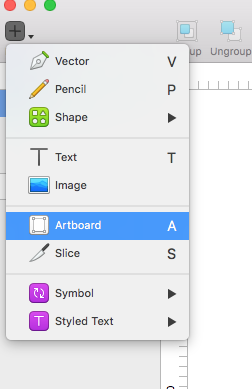

Select Artboard size from the right panel
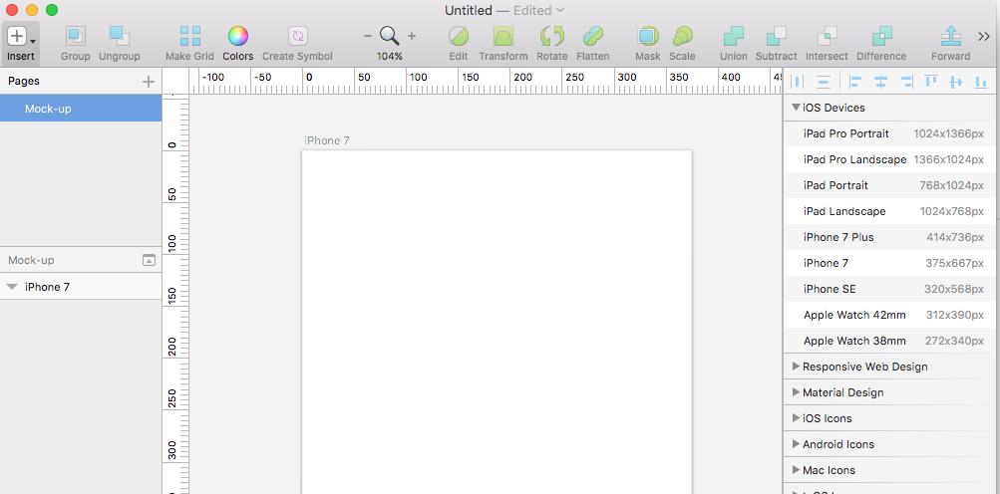

## Add An Image

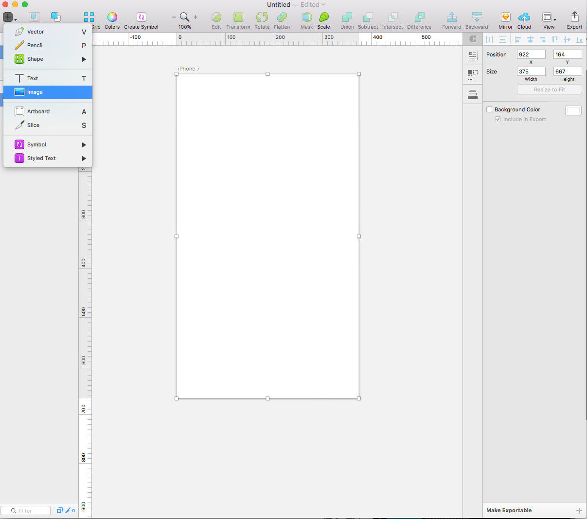

## Scale An Image

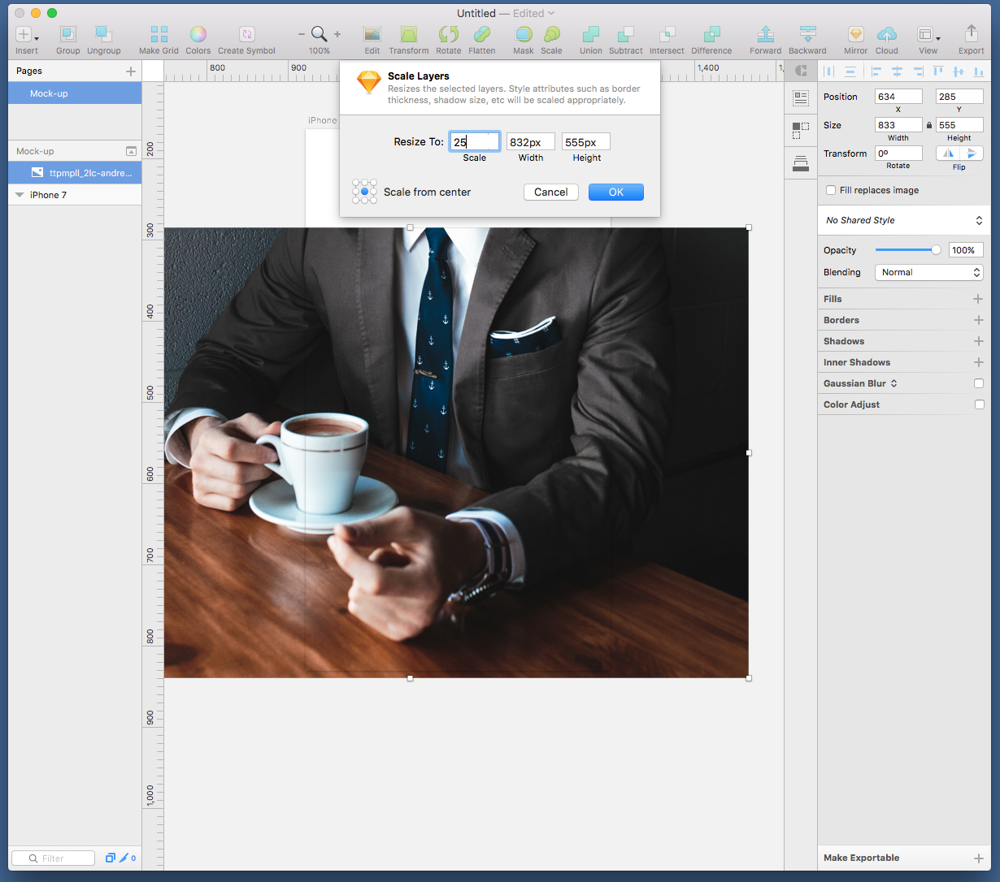

## Image Crop

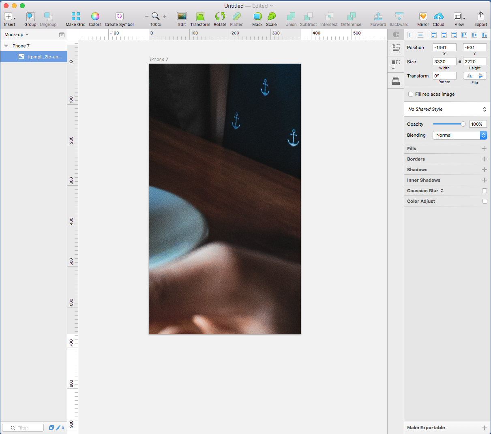

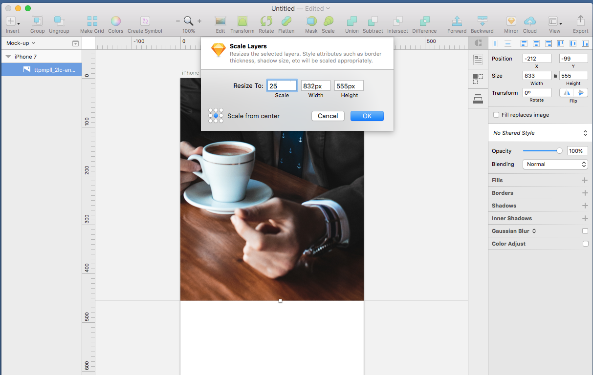

## Issues when importing images

## Image Masks

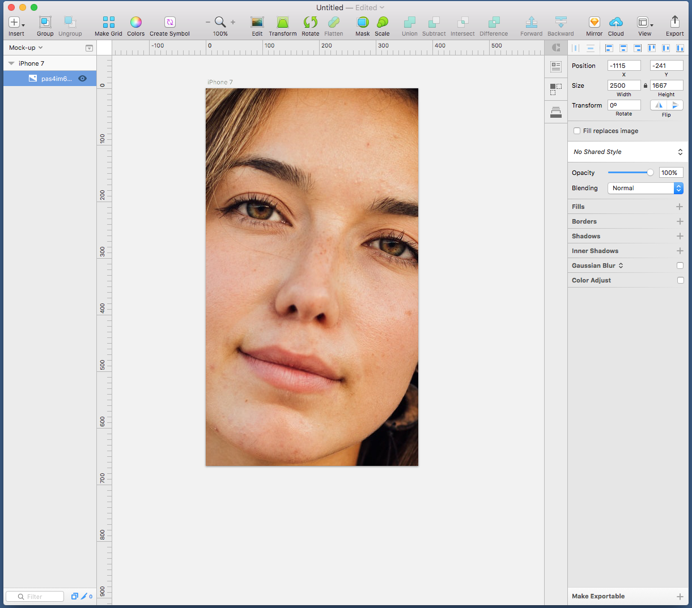

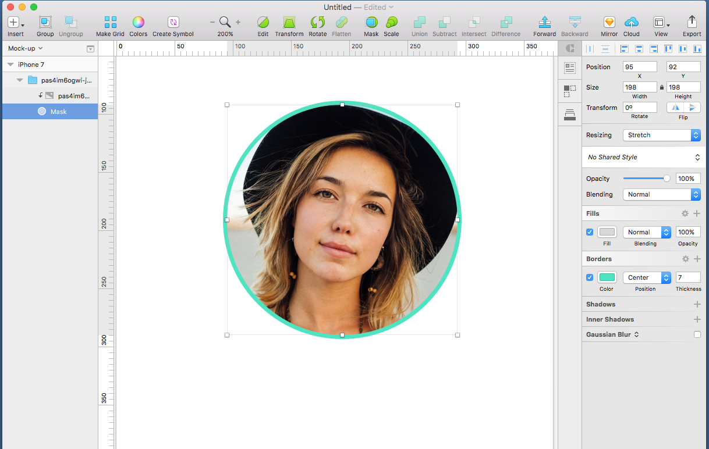

## Image Fills (Colour Overlay)

## Add Text

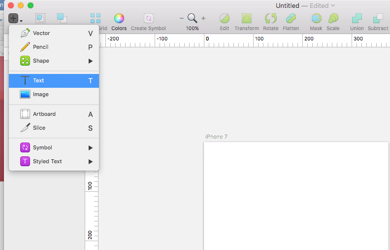

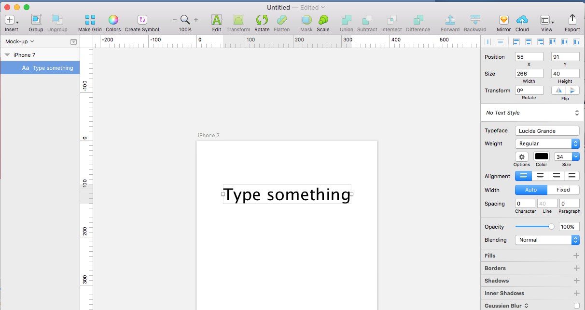

## Add Grid or Column Guides

## Working With Shapes

Create 2 Shapes: Rectangle & Triangle on top

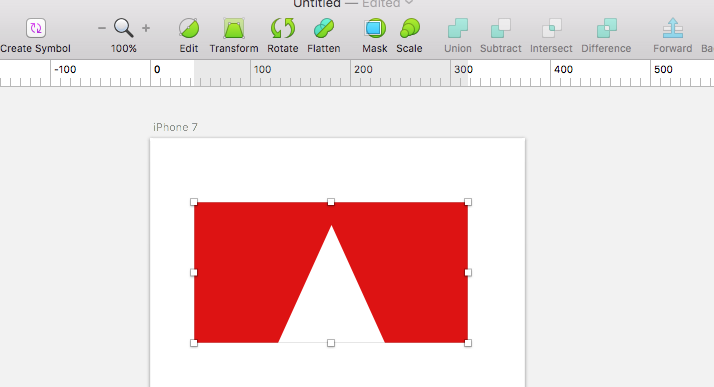

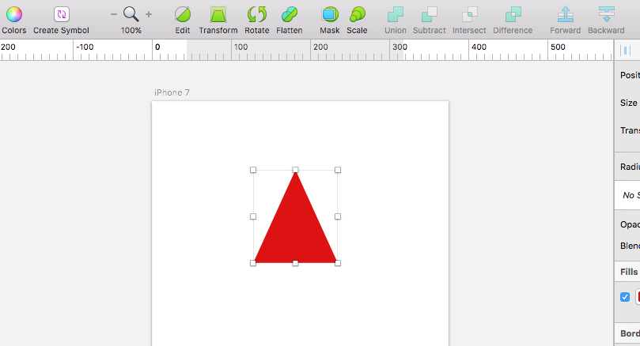

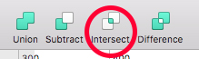

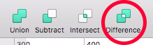
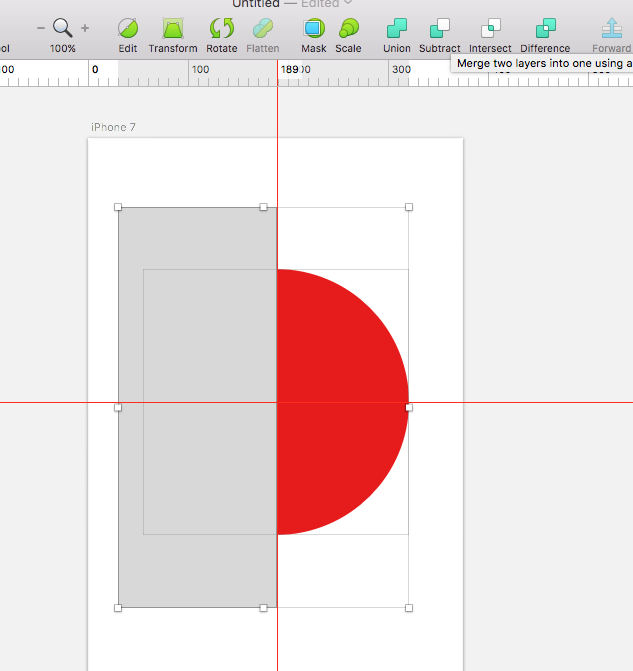

## Working with Symbols

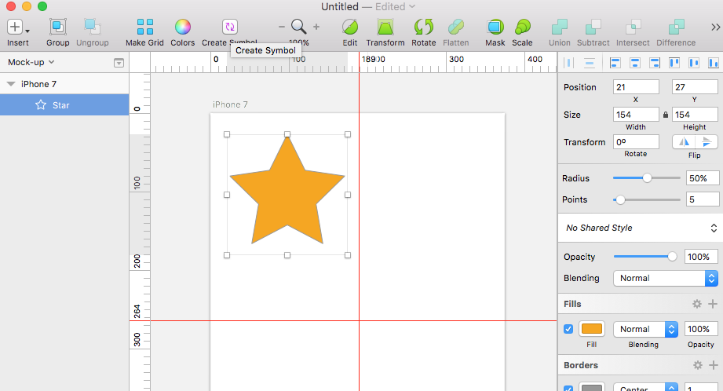

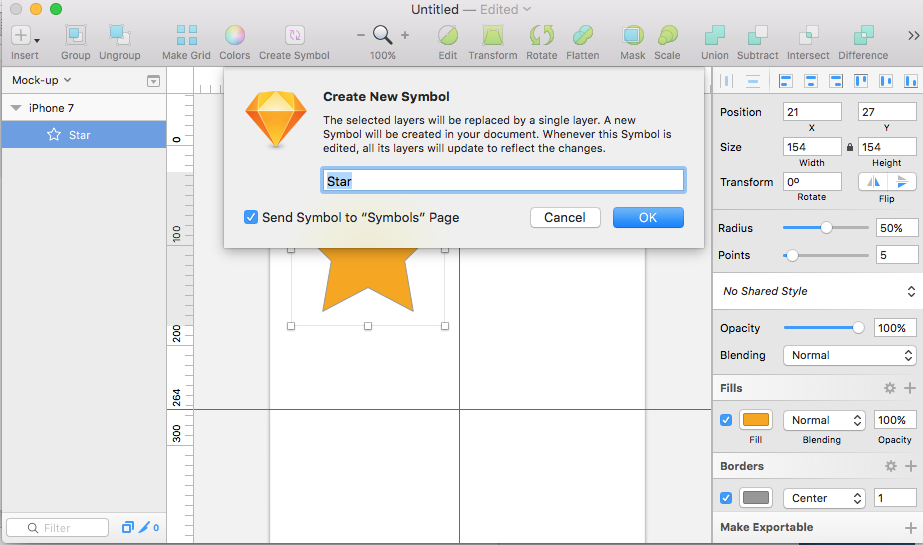

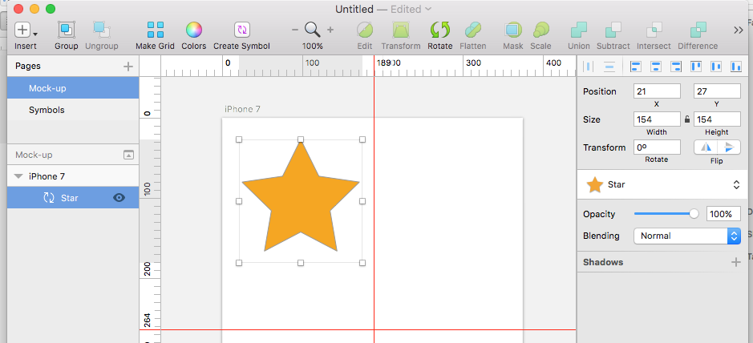

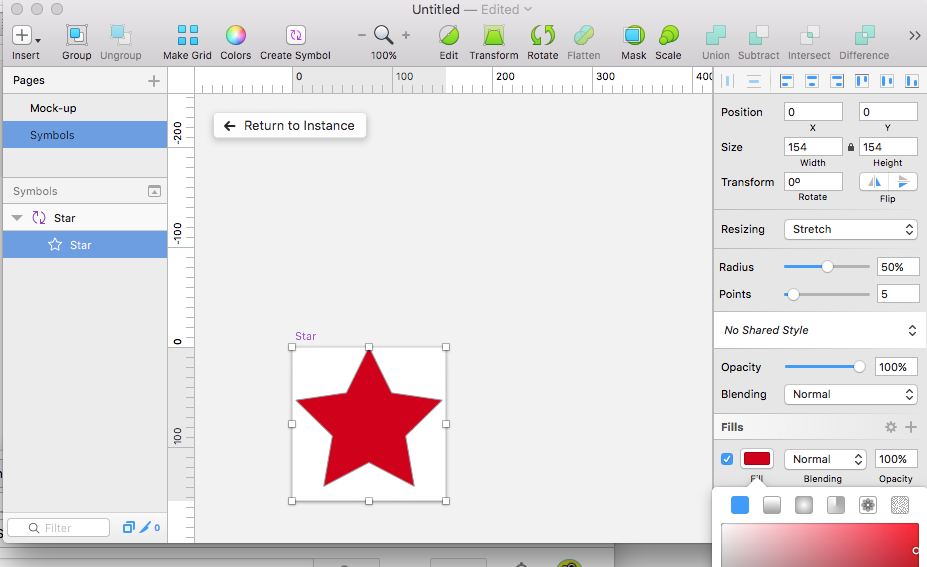

## Deleting Parts of Shapes

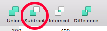

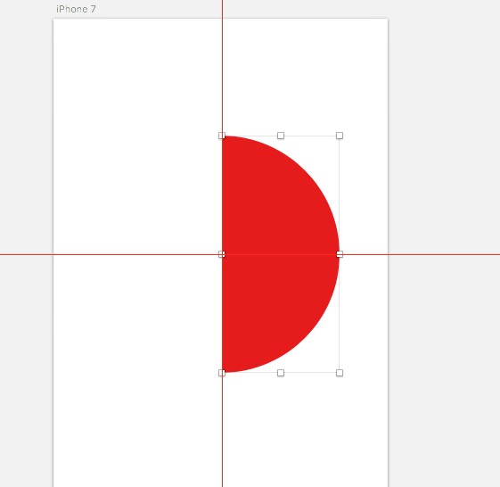

